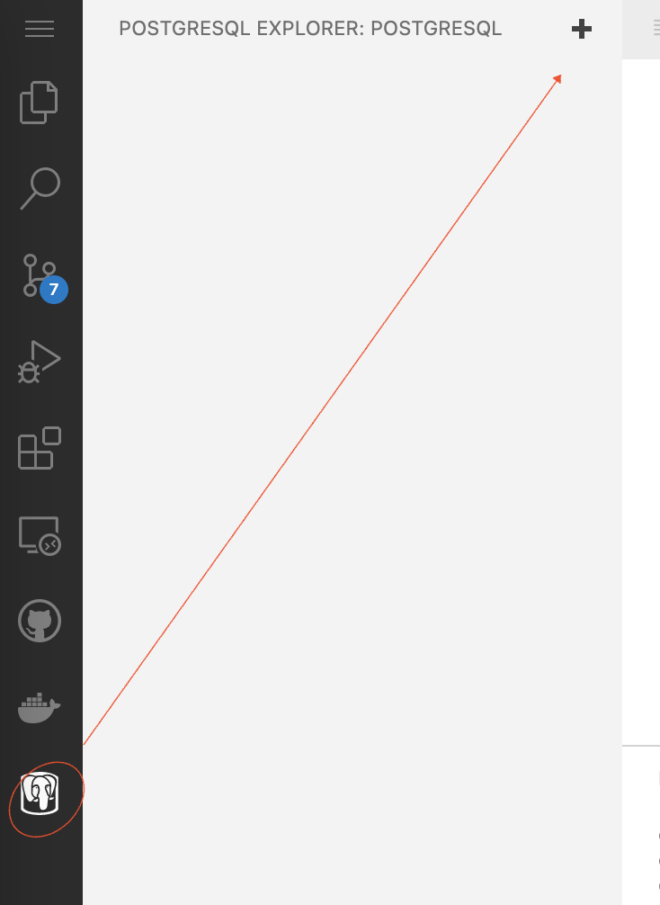
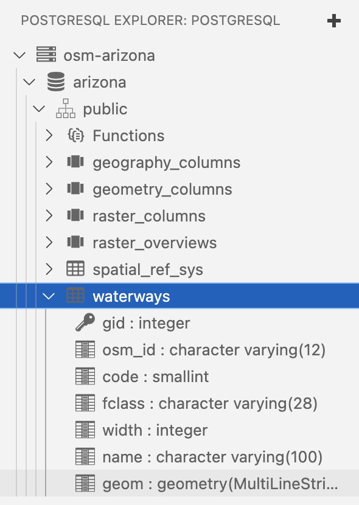

[](https://classroom.github.com/open-in-codespaces?assignment_repo_id=9227439)
# Assignment: PostGIS - OSM Data Load

## Background
_[OpenStreetMap](https://www.openstreetmap.org) (aka OSM) is a map of the world, created by people like you and free to use under an open license._ In this lab you are going to download the OSM data for the state of Hawaii and load it into a
PostGIS Database. 
- Nov 2020 article noting recent heavy corporate investment in OSM [link](https://joemorrison.medium.com/openstreetmap-is-having-a-moment-dcc7eef1bb01)

## Deliverables
in a new branch, `osm`:
- `import.sh` 
- `screencap-island-area.png`
- `screencap-road-length.png`

`import.sh` should contain all commands used to import the data into PostgreSQL. In practice, this file would be a functioning shell script that could be re-used to perform the full data import from the  unzipped shapefile to having fully populated tables in PostgreSQL.

### OpenStreetMap Data Model
Read about the OSM Data Model at [https://labs.mapbox.com/mapping/osm-data-model/](https://labs.mapbox.com/mapping/osm-data-model/). OSM Treats the world as vectors, specifically using the terminology `nodes`, `ways`, and `relations`. It does not 
map perfectly to the `points`, `lines`, and `polygons` models that you are used to. The model is also somewhat loosely defined and classes of entities such as roads are separated logically into different groups. Instead, they are represented by special attributes. Translating these entities to spatial layers requires a bit of work.

### Download OpenStreetMap Hawaii data

Download the Hawaii _shapefile_ (not the pbf file) for OpenStreetMap from [http://download.geofabrik.de/north-america/us/hawaii.html](http://download.geofabrik.de/north-america/us/hawaii.html). It will be named `hawaii-latest-free.shp.zip`.
```
mkdir -p data
curl https://download.geofabrik.de/north-america/us/hawaii-latest-free.shp.zip -o data/hawaii.shp.zip
unzip data/hawaii.shp.zip -d data/
```
You should see a lot of:
```
  inflating: gis_osm_water_a_free_1.shp  
  inflating: gis_osm_water_a_free_1.shx  
 extracting: gis_osm_waterways_free_1.cpg  
  inflating: gis_osm_waterways_free_1.dbf  
  inflating: gis_osm_waterways_free_1.prj  
  inflating: gis_osm_waterways_free_1.shp  
  inflating: gis_osm_waterways_free_1.shx  
  ```

In the Explorer panel, expand the `data` directory and load one of the `.prj` files in an Editor. It will contain the projection information:

```
GEOGCS["GCS_WGS_1984",DATUM["D_WGS_1984",SPHEROID["WGS_1984",6378137,298.257223563]],PRIMEM["Greenwich",0],UNIT["Degree",0.017453292519943295]]
```

This is `EPSG:4326`.

### Start the postgresql database
Start your database up in this codespace with the following:
```
mkdir -p postgres_data/data
docker run -d -p 5432:5432 -v $HOME/postgres_data/data:/var/lib/postgresql/data mdillon/postgis
```
It will take a few minutes for the DB to come up. When it does (about 20 seconds), you can create your new database for the OSM data.

### Create a `hawaii` database
Create a database for the OSM Data. You can do this through pgadmin but to make things more deterministic, type the following in a command window. Note that most of the following command is cruft required to pass the command to the server. The relevant SQL is simply `CREATE DATABASE hawaii`.

```
psql -c "CREATE DATABASE hawaii"
```
If you see `psql: error: connection to server at "localhost" (::1), port 5432 failed: server closed the connection unexpectedly`, wait a few seconds and try again.

Next, enable the `PostGIS` extension. The command is simply `CREATE EXTENSION postgis` but you pass `-d hawaii` to make it happen in that new database. Submit it like:

```
psql -U postgres -d hawaii -c "CREATE EXTENSION postgis"
```

### Load the OSM data into postgresql

The command to load the shapefile data into PostGIS is called `shp2psql`. You used that in the `nyc`-based workshop tutorial before. It is a command that takes a shapefile and turns into the PostgreSQL variant of SQL. When you run it you you will provide the name of a shapefile. By default the output will be printed to your screen (aka `STDOUT`) but you want to redirect the output to a file. 

```
shp2pgsql -s 4326 -c -g geom data/gis_osm_waterways_free_1.shp public.waterways | psql -d hawaii
```

A successful run will result in a large number of lines with lots of this:
```
INSERT 0 1
```

The above two commands will create and populate a table for `waterways` based on OSM data. Note this appears in two places in the command: 
- `gis_osm_waterways_free_1.shp` which is the name of the shapefile. You'll have to match each of the shapefiles that you extracted in the zip. 
- `public.waterways` which is the target table for this data. You can name that whatevery you want but it would best to be simple but also get rid of the extra `gis_osm_` prefix and `_free_1` suffix. Note that the word `natural` is a keyword in postgres so you cannot choose that name as an output table name.


### Download

You can check on the data in `PostgreSQL Explorer`. This is a new codespace so you will need to add a new database for this like you did in the PostGIS Intro assignment.

- (1/7) The hostname of the database
  - `localhost`
- (2/7) The PostgreSQL user to authenticate as
  - `postgres`
- (3/7) The password of the PostgreSQL user
  - `postgres` (will show up as `********`)
- (4/7) The port to connect to
  - `5432`
- (5/7) Use an ssl connection?
  - `Standard Connection`
- (6/7) Which databases to connect to
  - `hawaii`
- (7/7) The display name of the database connection
  - `osm-hawaii`
  
You should see the `waterways` table (the example below is for Arizona rather than Hawaii):



To see the data in a tabular way:
```
select * from waterways limit 1
```

If it looks good, do the same for the rest of the shapefiles in that directory. The following command will loop through all the shapefiles in the `data/` directory and run the `shp2pgsql` command to convert the shapefile data to SQL and import it into postgresql. There is some extra "stuff" to help prettify the names of the tables and avoid the `natural` term, which has a special meaning in postgresql.

```
for shp in $(ls data/*.shp | grep -v waterways ); do
  tab=$(echo $shp | sed 's/data\/gis_osm_//' |sed 's/_free_1.shp//' | sed 's/natural/nature/')
  shp2pgsql -s 4326 -c -g geom $shp public.$tab | psql -d hawaii
done
```

Tables containing `_a_` in them refer to polygons; hence some feature classes are 
represented both as points (e.g., `places`) and polygons (e.g., `places_a`). 

### Queries

Let's explore the data through SQL for a bit.

#### Area of Hawaiian Islands
First, let's calculate the area of the islands by looking at the `places_a` table.

```
select distinct(fclass) from places_a
```
Notice item 6 is `island`. Let's look at some of those records:
```
select * from places_a where fclass='island';
```

Let's order them from largest to smallest:
```
select st_area(geom), name from places_a where fclass='island' order by 1 desc;
```

The CRS is a lat/long coordinate system so the units are in square degrees. Hawaii takes up a lot of east-west space so both the UTM and StatePlane CRSes are split up into multiple reference systems. We don't need to be perfect so let's use the `::geography` conversion and get the area (which will be in square meters):

```
select st_area(geom::geography)/1000000 as area_sq_km, name from places_a where fclass='island' order by 1 desc;
```

See https://en.wikipedia.org/wiki/Hawaii for comparison

- Take a screenshot of your results window and save it as `screencap-island-area.png`
### Hawaiian Roads

Let's look at the roads table.
```
select * from roads limit 10;
```

Get the total length of different feature classes of roads across all the islands:

```
select sum(st_length(geom::geography)) as total_len, fclass from roads group by fclass order by 1 desc;
```

Finally, get the total road length by island across all the islands (regardless of fclass):

```
select sum(st_length(r.geom::geography))/1000 as road_length_km, sum(st_area(p.geom::geography))/1000000 as island_area_sqkm, p.name
from roads r, places_a p
where st_intersects(p.geom, r.geom) and p.fclass='island' 
group by p.name
order by 1 desc;
```

- Take a screenshot of your results window and save it as `screencap-road-length.png`


### Deliverables:
The following two files in a branch named `osm`, submitted as a Pull Request to be merged with master:
1) File named `import.sh` containing:
- all commands used to extract shapefile data into sql files (i.e. those , `shp2pgsql...`)
- all commands used to import sql files into postgresql (i.e., `psql...`)
